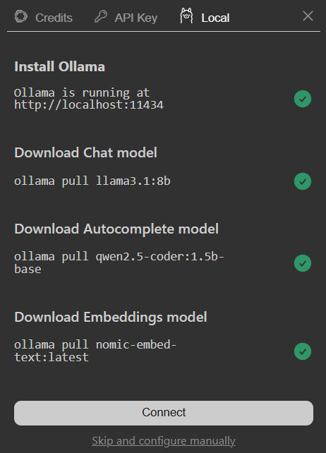
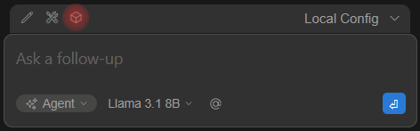

# AI 101: Getting started

## Introduction

This guide provides a simple introduction to Artificial Intelligence and a hands‑on tutorial for deploying, configuring, and using a local and cloud-based LLM.

## Overview

Artificial Intelligence (AI) refers to computer systems designed to perform tasks that normally require human intelligence. These tasks include understanding language, recognizing images, generating content, making predictions, and assisting with decision-making.

Modern AI systems are typically powered by [machine learning models](https://en.wikipedia.org/wiki/Machine_learning), especially [large language models (LLMs)](https://en.wikipedia.org/wiki/Large_language_model) trained on massive datasets.

### Common capabilities

* Natural language understanding
* Text generation
* Image recognition
* Code generation
* Data analysis
* Conversational assistants

### Most popular models

Some widely used AI platforms and tools include:

* [ChatGPT (OpenAI)](https://openai.com/chatgpt)
* [Claude (Anthropic)](https://claude.ai/)
* [Google Gemini](https://gemini.google.com/)
* [GitHub Copilot](https://github.com/features/copilot)
* [Ollama](https://ollama.com/)
* [Azure AI Foundry](https://azure.microsoft.com/en-us/products/ai-studio/)

## Prerequisites

To successfully follow this document, you need an [Active Azure subscription](https://azure.microsoft.com/en-us/free/) and administrator rights on your PC.

## Setup deployment

Follow this structural roadmap to configure your environment:

1. Install Ollama
2. Install Visual Studio Code
3. Create Azure AI Foundry and deploy a model
4. Install the Continue extension in VS Code
5. Configure the Ollama agent
6. Configure the OpenAI agent
7. Verify your setup

---

### 1. Install Ollama

Ollama allows you to run AI models locally on your machine.

1. Visit [https://ollama.com](https://ollama.com).
2. Download the installer for your operating system.
3. Install Ollama using the provided instructions.
4. Verify your installation by running this command in your terminal:

```bash
ollama --version
```

### 2. Install Visual Studio Code

1. Download VS Code from [https://code.visualstudio.com](https://code.visualstudio.com).
2. Install it using the default options.
3. Launch VS Code.

### 3. Create Azure AI Foundry and deploy a model

Next, you will deploy a cloud-based AI model using Azure.

#### AI Foundry deployment

1. Open Azure Portal → Search Microsoft Foundry → Click Create

.png>)

2. Configure Basics (Subscription, Resource Group, Name, Region, Project)

.png>)

3. Start deploy by clicking on "Review + Create" button

.png>)

4. After deployment complete open resource and click on "Go to Foundry portal"


#### Model deployment

1. In the Foundry portal, choose "Browse models"

.png>)

2. Choose a model 

.png>)

3. Deploy a model (for this demo will be used gpt-5.3-chat)

.png>)

4. After deployment complete you can select "Playground" section and try promt to the model

.png>)
 

> [!NOTE]
> Copy model name (gpt-5.3-chat in this demo),Target URI and Key. These values will be used for Agent configuration.

### 4. Install the Continue extension in VS Code

1. Open VS Code and navigate to the **Extensions** view.
2. Find the **Continue** extension and install it


### 5. Configure the Ollama agent

To start using Ollama agent you'll need to configure it in Continue. To do so click on "Continue" icon in the left sidebar and then click on the **Local** tab:


Choose Ollama and install default local models:




Congrats. Now you can try to send your first message to agent. Below Continue window main areas overview:


### 6. Configure the OpenAI agent

Next, configure Continue to use your Azure OpenAI deployment. To do so, click on "box" icon:




Add the following configuration block (for apiBase and apiKey use values from previously deployed model):

```json
  - name: azure-openai-gpt-5.3-chat
    model: gpt-5.3-chat
    provider: azure
    apiBase: https://<some-id>.openai.azure.com/
    apiKey: <api-key>
    env:
      apiVersion: 2024-05-01-preview
      deployment: gpt-5.3-chat
      apiType: azure-openai

```
> [!NOTE]
> apiBase should be ```https://<some-id>.openai.azure.com/``` not ```https://<some-id>.openai.azure.com/<some-uri>```

Replace `apiBase` with your saved endpoint, `apiKey` with your Azure key, and `model` with your deployed model name. Save the file.

### 7. Verify your setup

Ensure everything is working together in your development environment.

1. Open a project folder in VS Code.
2. Open the **Continue** panel.
3. Select either your local Llama model or your Azure OpenAI model.
4. Ask a test question to verify the integration is successful.

---

Would you like me to help draft an introductory tutorial to place before this guide, to better serve users who are entirely new to using a terminal or VS Code?