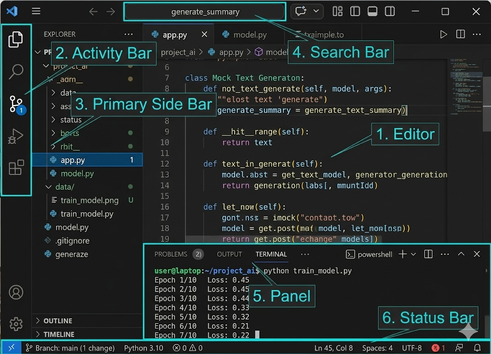
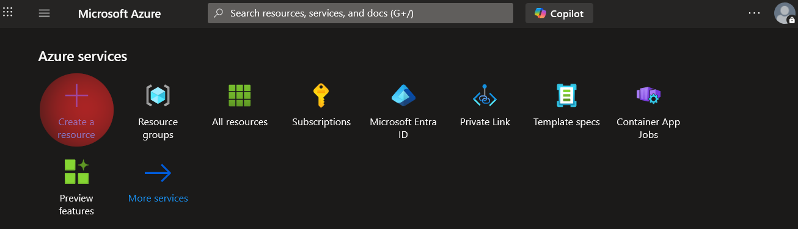
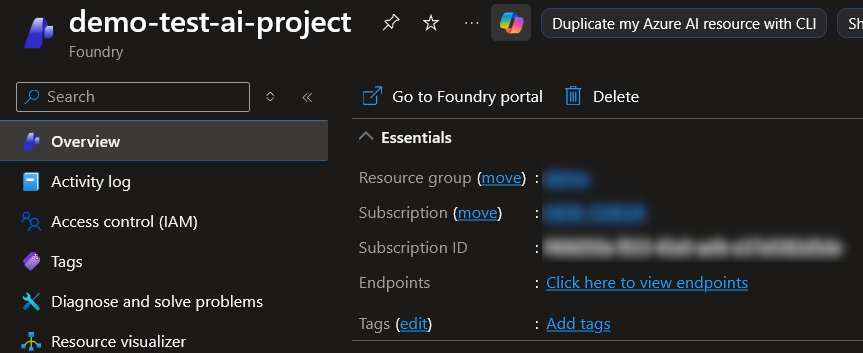
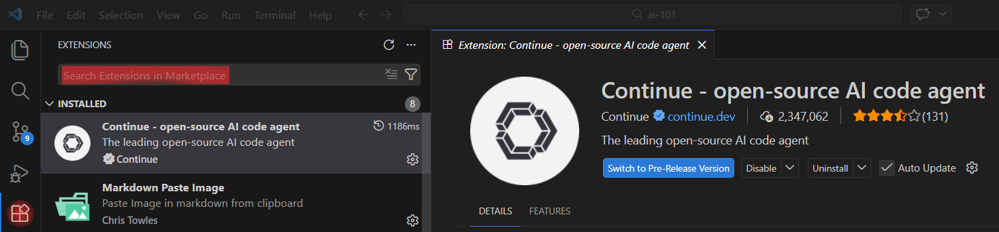
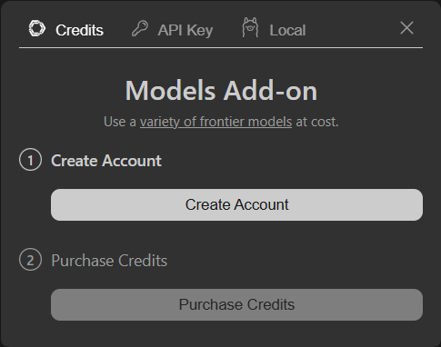
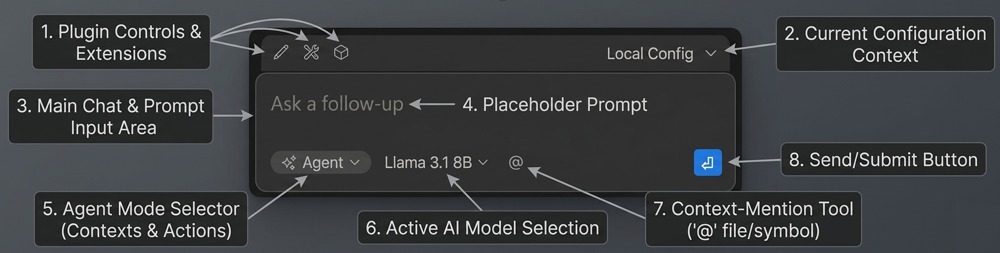
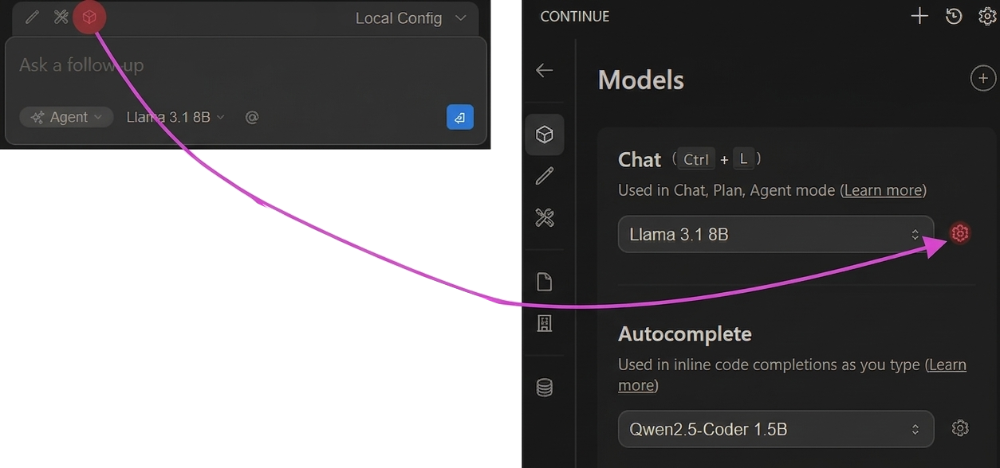
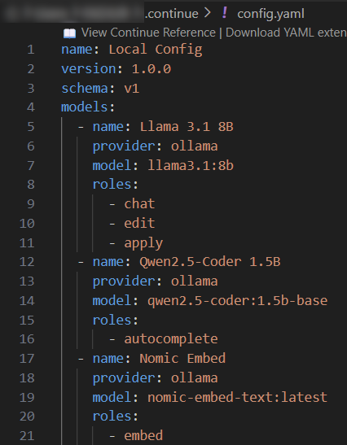
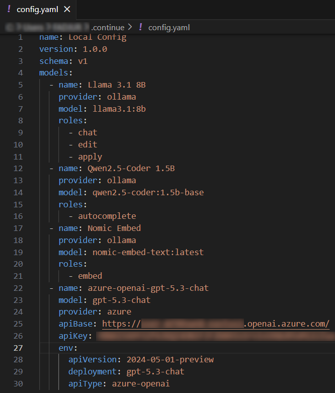
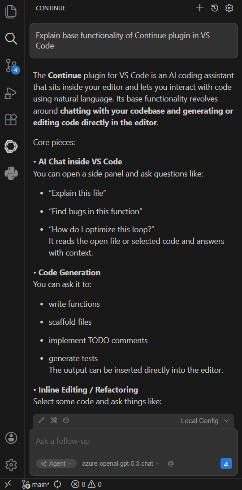

# AI 101: Initial Setup (part 1)


## Introduction

This guide provides a hands-on tutorial for deploying, configuring, and using local and cloud-based Large Language Models (LLMs). By the end of this tutorial, you will have a functional AI development environment using Ollama, Azure AI Foundry, and Visual Studio Code.

## Before you begin

To complete this tutorial, ensure you have the following:
* Azure Subscription: An active Azure subscription with permissions to create resources.
* System Access: Administrator rights on your local machine.
* Baseline Knowledge: Familiarity with using a terminal/command prompt.
## Setup deployment

Follow this structural roadmap to configure your environment:

1. Install Ollama
2. Install Visual Studio Code
3. Create Azure AI Foundry and deploy a model
4. Install the Continue extension in VS Code
5. Configure the Ollama agent
6. Configure the OpenAI agent
7. Verify your setup

### 1. Install Ollama

Ollama allows you to run AI models locally on your machine.

1. Visit [https://ollama.com](https://ollama.com).
2. Download the installer for your operating system.
3. Install Ollama using the provided instructions.
4. Verify your installation by running this command in your terminal:

```bash
ollama --version
```

### 2. Install Visual Studio Code

1. Download VS Code from [https://code.visualstudio.com](https://code.visualstudio.com).
2. Install it using the default options.
3. Launch VS Code.

Here main sections VS code overview:



### 3. Create Azure AI Foundry and deploy a model

Next, you will deploy a cloud-based AI model using Azure.

#### AI Foundry deployment

1. Open Azure Portal -> Click "Create a resource" button



2. Search Microsoft Foundry → Click Create

.png>)

3. Configure Basics (Subscription, Resource Group, Name, Region, Project Name)

.png>)

4. Start deploy by clicking on "Review + Create" button

.png>)

5. After deployment complete open resource and click on "Go to Foundry portal"



#### Model deployment

1. In the Foundry portal, choose "Browse models"

.png>)

2. Choose a model 

.png>)

3. Deploy a model (for this demo will be used gpt-5.3-chat)

.png>)

4. After deployment complete you can select "Playground" section and try promt to the model

.png>)
 

> [!NOTE]
> Copy model name (gpt-5.3-chat in this demo),Target URI and Key. These values will be used for Agent configuration.

### 4. Install the Continue extension in VS Code

1. Open VS Code and navigate to the **Extensions** view(four square symbol).
2. Find the **Continue** extension and install it.



### 5. Configure the Ollama agent

To start using Ollama agent you'll need to configure it in Continue. To do so click on "Continue" icon in the left sidebar and then click on the **Local** tab:



Choose Ollama and install default local models:


After installation completed click "Connect" button. Now you can try to send your first message to agent. Below chat window main areas overview:




### 6. Configure the OpenAI agent

Next, configure Continue to use your Azure OpenAI deployment. To do so, click on "box" icon -> select gear icon:



You should see something like this:



Append file with Azure GPT model config:
```json
  - name: azure-openai-gpt-5.3-chat
    model: gpt-5.3-chat
    provider: azure
    apiBase: https://<some-id>.openai.azure.com/
    apiKey: <api-key>
    env:
      apiVersion: 2024-05-01-preview
      deployment: gpt-5.3-chat
      apiType: azure-openai
```

> [!NOTE]
> apiBase should be ```https://<some-id>.openai.azure.com/``` not ```https://<some-id>.openai.azure.com/<some-uri>```

Replace `apiBase` with your saved endpoint, `apiKey` with your Azure key, and `model` with your deployed model name. Save the file.

As a result you should got something like this:



> [!NOTE]
> To save changes in config.yaml file use the shortcut Ctrl+S for Windows/Linux and Cmd + S for Mac
### 7. Verify your setup

Ensure how newly deployed model works:




## Summary

You have successfully configured a hybrid AI environment that balances local privacy with cloud power. 
To maximize the utility of these models, review the upcoming guide on Prompt Engineering Basics to learn about system prompts and few-shot prompting.