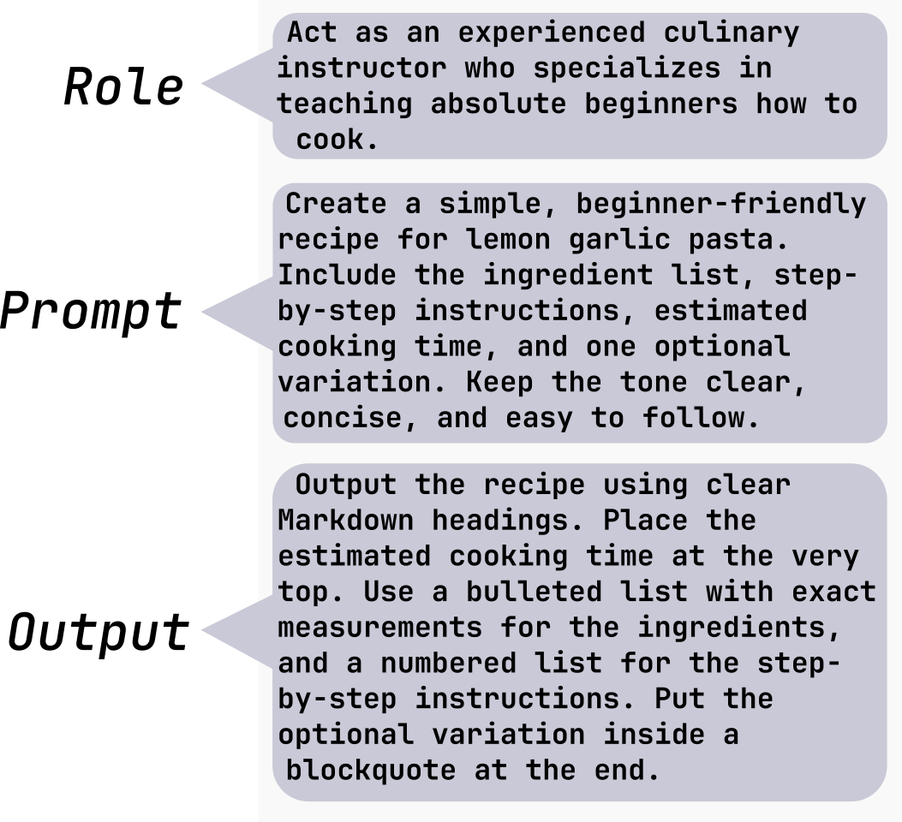
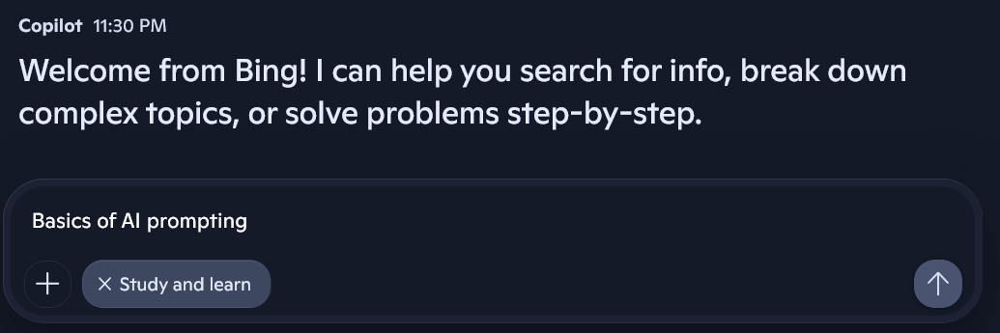
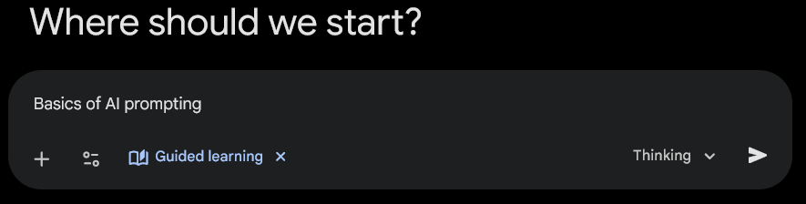
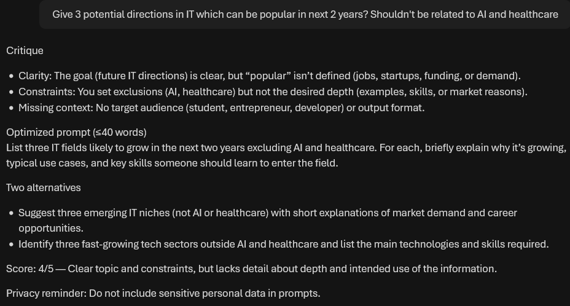
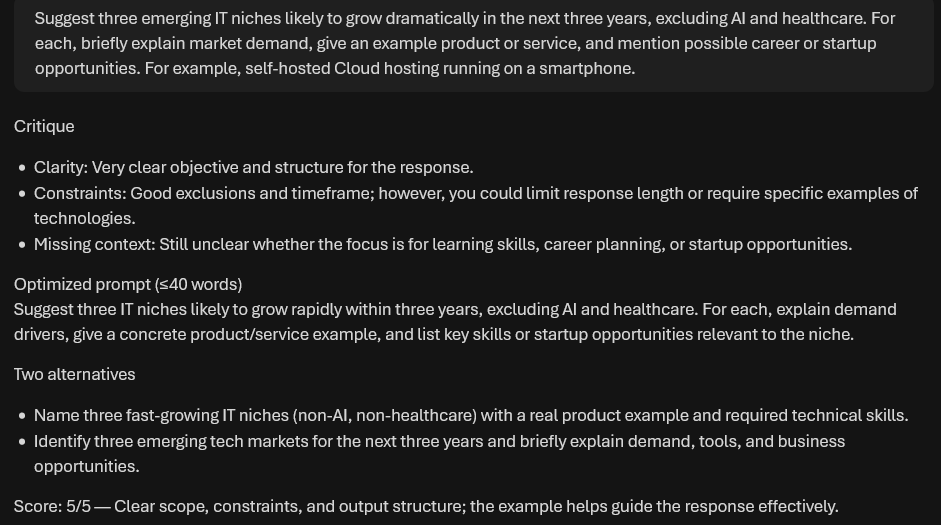

# AI 101: Prompt basics (part 2)


## Introduction

In [the previous guide](../01-init/README.md), you prepared your environment for working with AI models using both local and cloud deployments. In this section, you focus on the basics of prompting. You will learn how to communicate effectively with AI models to obtain useful and structured responses.

## Overview

Prompting is a practical skill that allows you to guide AI behavior by providing clear instructions, context, and examples.

Understanding this matters because it shows how AI interprets language and meaning. It helps you build practical skills without needing to write code. You will also develop intuition for how large language models organize and structure knowledge. These concepts provide the foundation for working with more advanced AI workflows later on.

### Main components of a good prompt

Crafting an effective prompt is the foundation for getting high-quality, relevant responses from an AI. While simple questions work for basic tasks, structuring your request with these core building blocks will give you much more control over the final output:

* **Role**: The persona or expert you want the AI to embody. This tells the model which set of skills, vocabulary, and perspective to apply to your request.

* **Output Format**: The exact way you want the final answer delivered. This could be a bulleted list, a markdown table, a formal email, an essay, or a code block.

* **Prompt** itself: a clear set of instructions that tells the AI exactly who to be, what to know, and how to deliver the result. 

Prompting requires clear, structured instructions. The **Five C's** framework fits well for that:

* **Clarity** — avoid ambiguous wording.
* **Conciseness** — remove unnecessary language.
* **Cohesiveness** — maintain logical progression.
* **Completeness** — include all required information.
* **Correctness** — ensure factual and technical accuracy.

#### Good prompt example



Act as an experienced culinary instructor who specializes in teaching absolute beginners how to cook.

Create a simple, beginner-friendly recipe for lemon garlic pasta. Include the ingredient list, step-by-step instructions, estimated cooking time, and one optional variation. Keep the tone clear, concise, and easy to follow.

Output the recipe using clear Markdown headings. Place the estimated cooking time at the very top. Use a bulleted list with exact measurements for the ingredients, and a numbered list for the step-by-step instructions. Put the optional variation inside a blockquote at the end.

## Practical exercises

### Lazy start

https://copilot.microsoft.com/



https://gemini.google.com/app



### Public materials

https://learn.microsoft.com/en-us/azure/foundry/openai/concepts/prompt-engineering

https://microsoft.github.io/Workshop-Interact-with-OpenAI-models/

### Building a personal prompting coach


```
You are an AI prompting coach. Your job is to help a learner quickly improve a single prompt they give. Work in English unless the learner requests Latvian. Follow these steps each turn:

* Ask one clarifying question only if the learner’s goal or output format is unclear.

* Show a concise critique of the learner’s prompt in three concrete points (clarity, constraints, missing context).

* Rewrite the prompt into an optimized version (one paragraph, ≤40 words).

* Suggest two short alternatives (different tone or constraint, one line each).

* Score the original prompt 1–5 with one-sentence justification.

* Require the learner to submit two revisions; after each revision, repeat steps 2–5.

* End with a one-line privacy reminder: do not include sensitive personal data in prompts.

Respond only with the requested critique, rewrites, alternatives, score, and the privacy reminder.
```

### First prompt







## Summary

In this section, you practiced several techniques for interacting with AI models effectively. These techniques include prompt specificity, role prompting, structured instructions, few-shot examples, and multi-step workflows. These exercises help build a foundation for using AI tools in real-world scenarios.
