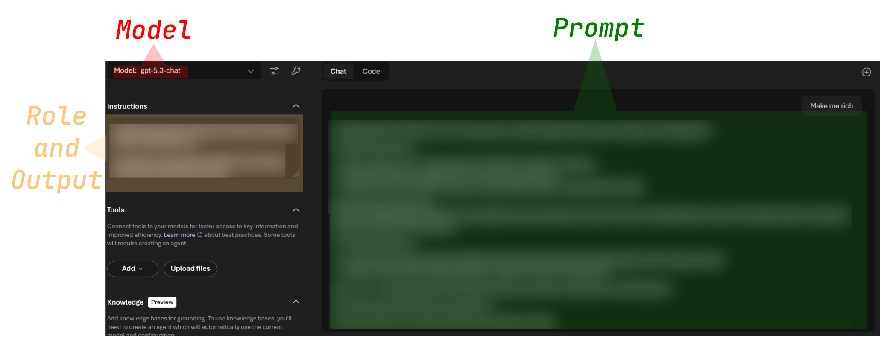
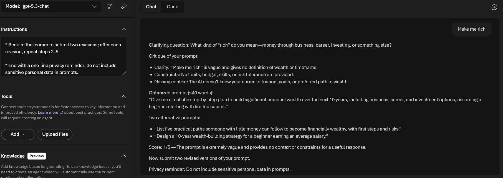

# AI 101: Prompt basics (part 2)


## Introduction

In the [previous guide](../01-init/README.md), you prepared your environment for working with AI models using both local and cloud deployments.

This section introduces the fundamentals of **prompting**. Prompting is the process of giving instructions to an AI model so it produces useful and structured responses.

You will learn how to communicate effectively with AI systems and how prompt structure influences the quality of responses.

## AI theory

Chat AI systems rely on four core components: **weights, context window, system prompt, and output formatting**.

**Weights** are parameters learned during model training on large datasets such as books, websites, and articles. They encode statistical language patterns used to predict the next token in a sequence.

Weights remain fixed after training. The model cannot permanently learn new information during a conversation.

The model processes input using a **context window**, which is a limited amount of text measured in **tokens**.

The context window contains:

- user messages
- model responses

When the token limit is reached, earlier parts of the conversation may be removed from the context. As a result, the model can lose information from earlier messages.

A **system prompt** defines the model’s role, behavior, and constraints at the start of a session.

It can specify:

- the role or task (assistant, teacher, developer)
- response style or tone
- behavioral rules such as brevity or terminology restrictions

The model can also follow structured instructions for formatting responses.

Examples include:

- bulleted lists
- emails
- structured text formats

**Stop sequences** can define where the model should stop generating output.

## AI theory (simplified explanation)

A simple analogy is to imagine a person who once read almost every book, website, and article in the world. After a major accident, their brain changed in specific ways.

They still remember everything they learned before the accident, but they cannot store new permanent knowledge.

### The permanent library (model weights)

Before the accident, the reader learned from an enormous amount of text. In AI terms, this knowledge represents the model’s **weights**.

- **Frozen knowledge** — everything learned before the "incident" remains available.
- **Pattern recognition** — the reader is very good at predicting what word or idea should come next in a sentence.

### The temporary scratchpad (context window)

During a conversation, the reader keeps a **scratchpad**.

This represents the **context window**.

The scratchpad contains everything said during the conversation. However, it has limited space.

When the scratchpad becomes full, older notes must be erased to make space for new ones. This is why long conversations can cause the model to forget earlier information.

### Reminding the reader who they are (system prompt)

At the start of a conversation, the reader needs instructions about their role.

Examples:

- "You are a world‑class lawyer."
- "You are a creative storyteller."
- "You are a cybersecurity analyst."

This instruction helps the model focus on the most relevant part of its knowledge.

### Providing a template (output format)

Because the reader is excellent at recognizing patterns, they can follow structured templates.

Examples:

- "Provide the explanation as a bulleted list."
- "Write the response as a professional email."
- "Give step‑by‑step instructions."

You can also define when the model should stop generating output.

Example:

> List exactly five items and then stop.

## Prompt theory

Prompting is a practical skill that allows you to guide AI behavior using clear instructions, context, and constraints.

Understanding prompting helps you build useful workflows without writing code. It also helps you understand how language models organize information and generate responses.

### Main components of a good prompt

An effective prompt typically includes three key elements.

**Role**

The role defines the persona or expertise the AI should assume.

Examples:

- "Act as an experienced Python developer."
- "Act as a cybersecurity analyst."
- "Act as a beginner cooking instructor."

**Output format**

The output format defines how the response should be structured.

Examples include:

- bulleted lists
- tables
- Markdown sections
- emails
- code blocks

**Clear instructions**

The prompt itself should clearly describe the task you want the AI to perform.

Prompting works best when instructions follow the **Five C's framework**.

- **Clarity** — avoid ambiguous wording
- **Conciseness** — remove unnecessary language
- **Cohesiveness** — maintain logical progression
- **Completeness** — include all required information
- **Correctness** — ensure factual and technical accuracy

### Good prompt example

Example prompt for a lemon garlic pasta recipe:

> Act as an experienced culinary instructor who teaches absolute beginners.
> Create a simple lemon garlic pasta recipe.
> Include ingredients, step‑by‑step instructions, estimated cooking time, and one optional variation.
> Format the output using Markdown headings, a bulleted ingredient list, and numbered steps.

Main parts:


## Practice

The best way to learn prompting is to experiment.

Try different prompts and observe how small changes affect the AI response.

### Getting started with AI assistants

If you are unsure how to phrase prompts, you can ask AI assistants for help.

Examples include:

- https://copilot.microsoft.com/
- https://gemini.google.com/app

These tools can:

- explain prompting concepts
- critique prompts
- suggest better prompt structures


### Public learning resources

https://learn.microsoft.com/en-us/azure/foundry/openai/concepts/prompt-engineering

https://microsoft.github.io/Workshop-Interact-with-OpenAI-models/

https://aiskillsnavigator.microsoft.com/explore/search/learningpath-28b43360780055d5153fa2bf38eb8921291405edde596e61d5640f82393ec499

## Build your own prompt coach

You can use AI itself to improve your prompting skills.

Open the **Azure AI Foundry portal**, choose a model, and select **Playground**.

The prompt interface has two sections:

- **Instructions** — defines the agent role and response behavior
- **Chat** — contains your prompt



Copy the following text into the **Instructions** section:

```
You are an AI prompting coach. Your job is to help a learner quickly improve a single prompt they give. Work in English unless the learner requests Latvian. Follow these steps each turn:

- Ask one clarifying question only if the learner’s goal or output format is unclear.
- Show a concise critique of the learner’s prompt in three concrete points (clarity, constraints, missing context).
- Rewrite the prompt into an optimized version (one paragraph, ≤40 words).
- Suggest two short alternatives (different tone or constraint, one line each).
- Score the original prompt 1–5 with one-sentence justification.
- Require the learner to submit two revisions; after each revision, repeat steps 2–5.
- End with a one-line privacy reminder: do not include sensitive personal data in prompts.

Respond only with the requested critique, rewrites, alternatives, score, and the privacy reminder.
```

Now try different prompts.




## Summary

In this section you practiced several techniques for interacting effectively with AI models.

These include prompt specificity, role prompting, structured instructions, and iterative prompt improvement.

These skills form the foundation for using AI tools in real‑world workflows.

