# AI 101: AI IDE Basics (Part 3)


In this tutorial we continue exploring how AI can be integrated into the development workflow inside VS Code.
So far we focused mainly on interacting with the AI through individual prompts.

However, real development workflows require more than ad‑hoc prompts. Teams often need the AI assistant to:

• follow project conventions
• reuse common instructions
• access internal tools and services

In this part we move one step further and explore how to configure and extend the assistant itself so that it behaves consistently across a project.

## What you will build

In this tutorial you will configure Continue to behave like a **custom AI development assistant for your project**.

Specifically, you will try:

• **workspace rules** that guide the AI’s behavior  
• **reusable prompts** for common development tasks  
• **MCP servers**  

For MCP part, you will set up two example servers that expose external tools to the AI assistant:

• [**time‑mcp**](../tools/src/time-mcp) — provides system time  
• [**pwsh‑mcp**](../tools/src/pwsh-mcp) — allows to execute PowerShell commands

These examples illustrate how AI assistants can interact with **real tools instead of only generating text**.

## Part 1 – Concepts

### Overview

Continue provides several mechanisms that allow developers to control:

• how the AI behaves  
• what information it can access  
• which external tools it can use

The main components are shown below.

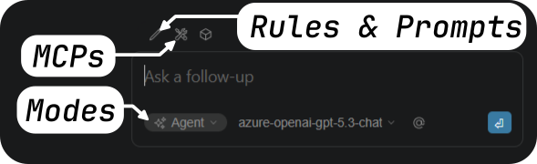

The key elements of the Continue ecosystem are:

• **Rules** — persistent instructions that shape the AI's behavior  
• **Prompts** — reusable instructions for specific tasks  
• **Modes** — different levels of AI autonomy  
• **MCP servers** — external tools that extend the AI's capabilities

Together these components allow developers to control both the **behavior** and the **capabilities** of the AI assistant.

### Continue configuration

The Continue extension can be configured to control how it behaves inside VS Code and what capabilities are available to the AI model.

Configuration typically defines:

• which AI models are available  
• rules that guide the AI's behavior  
• reusable prompts  
• MCP servers that expose external tools

These configuration elements allow teams to create a **consistent AI workflow across projects**.

For example, a team might configure Continue to:

• always follow project coding standards  
• provide prompts for common development tasks  
• connect to internal documentation systems  
• expose scripts or automation tools through MCP

This makes the AI assistant behave more like a **specialized development tool** rather than a generic chatbot.

### Modes

When interacting with the assistant, Continue can operate in several modes.

Each mode defines how much freedom the AI has when interacting with the workspace and external tools.
This helps balance safety, transparency, and automation during development.

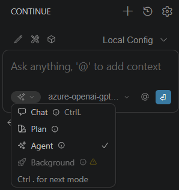

Each mode determines **how much autonomy the AI has** and which tools it is allowed to use.

| Mode | Purpose | Capabilities | Typical Usage |
| -- | --- | --- | --- |
| Chat | Conversational assistance | No tools available | Learning, discussion, brainstorming |
| Plan | Safe exploration and planning | Read‑only tools | Code inspection and solution design |
| Agent | Task execution | Full tool access | Implementing changes and automation |

Typical workflow:

1. Use **Chat** to understand a problem  
2. Use **Plan** to explore the codebase and design a solution  
3. Use **Agent** to implement the changes

### System Rules and Prompts

Continue allows developers to customize AI behavior using **Rules** and **Prompts**.

Although they both influence how the AI responds, they serve different purposes.

#### Rules

Rules are **persistent instructions** added to the AI system context.

They apply to every interaction inside a project and ensure that the AI consistently follows project guidelines.

Examples of rules:

• Always follow the project's coding conventions  
• Prefer TypeScript over JavaScript  
• Avoid modifying files outside the current module  
• Keep functions small and focused

Rules help enforce **team standards and architectural decisions**.

#### Prompts

Prompts are **task‑specific instructions** used when performing a particular action.

Unlike rules, prompts are not always active and are invoked only when needed.

Typical prompts might include:

• generate unit tests for this file  
• refactor this code for readability  
• convert this function to async/await  
• generate API documentation

Prompts allow teams to standardize common development workflows.

#### Rules vs Prompts

The main difference between rules and prompts is their **scope and persistence**.

Rules influence **every interaction** with the AI inside the workspace.

Prompts are **temporary instructions** used for a specific task.

Used together, they provide both:

• **long‑term behavioral guidance**  
• **short‑term task instructions**

### Model Context Protocol (MCP)

Modern AI assistants are most useful when they can interact with the developer's environment.

For example, an assistant might need to:

• read files from the project
• query a database
• run scripts or automation tools
• interact with APIs such as GitHub

Without a standard mechanism for these interactions, every AI system would need custom integrations for each tool.
This quickly becomes difficult to maintain.

The Model Context Protocol (MCP) was designed to solve this problem - it is an open standard designed to allow AI models to interact with external systems.

Instead of embedding integrations directly inside the AI assistant, MCP provides a standardized interface that allows tools to be connected dynamically.

Through MCP, an AI system can interact with:

• databases  
• file systems  
• APIs  
• automation tools  
• development platforms such as GitHub

This allows AI assistants to move beyond simple text generation and perform **real development tasks**.

### MCP Architecture

MCP uses a **host–client–server architecture** that separates the AI model from the external tools it uses.

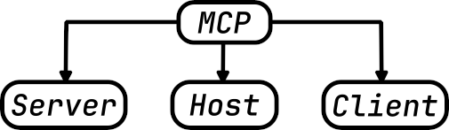

#### Host

The **host** is the application where the AI assistant runs.

In this tutorial, the host is **VS Code with the Continue extension**.

The host manages:

• user interaction  
• the AI model  
• security boundaries

#### Client

The **client** is the communication layer inside the host.

It translates AI requests into MCP messages and maintains connections to MCP servers.

#### Server

An **MCP server** exposes external functionality to the AI assistant.

Examples include services that provide:

• database queries  
• API access  
• system utilities  
• developer tools

#### MCP in simple terms

In the same way that USB‑C standardized hardware connectivity, MCP aims to standardize how AI systems connect to tools and services.

Before USB‑C, every device required its own connector or adapter.

AI integrations face a similar problem today.  
Every AI system typically requires custom integrations for:

• APIs  
• developer tools  
• internal services  
• databases

MCP standardizes this interaction.

Developers implement an **MCP server once**, and any compatible AI system can use it.

## Part 2 – Practical exercise

### Initial setup

Continue can be configured globally or per workspace. That means each project can use different rules, prompts, and MCP servers. In most teams these configuration files are stored directly in the repository. This ensures that every developer working on the project uses the same AI configuration, including rules, prompts, and available tools.

As a result, the AI assistant becomes part of the development environment itself rather than a personal customization of an individual developer.

For easiest setup, this repository already includes example configuration files for rules, prompts, and MCP servers.

Just download it locally as [ZIP](https://github.com/groovy-sky/ai-101/archive/refs/heads/main.zip), extract it, and open it in VS Code.

Alternatively, you can git clone the repository:

```git clone git@github.com:groovy-sky/ai-101.git```

Now just open VS Code -> File -> Open Folder -> select the `ai-101` folder.

You should get something similar to this:

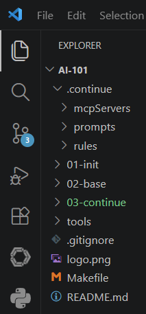

All Continue configuration files are stored inside the [`.continue`](../.continue/) directory at the root of the workspace.

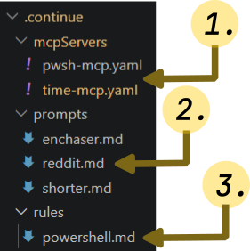

The main configuration elements are:
1. ".continue/mcpServers" folder stores MCP configurations. In this tutorial 2 MCP servers are configured: [time-mcp](../.continue/mcpServers/time-mcp.yaml) and [pwsh-mcp](../.continue/mcpServers/pwsh-mcp.yaml)
2. ".continue/prompts" folder stores reusable prompts. In this tutorial 3 prompts are configured: [enchaser](../.continue/prompts/enchaser.md) (for improving technical documentation), [reddit](../.continue/prompts/reddit.md)(for generating engineering-style Reddit posts), and [shorter](../.continue/prompts/shorter.md)(removes non‑essential text). 
3. ".continue/rules" folder stores persistent rules. In this tutorial 1 rule is configured - [powershell](../.continue/rules/powershell.md) (defines PowerShell scripting conventions and coding standards).

### MCP configuration

#### Prerequisites

Before testing the **pwsh-mcp** server, ensure that **PowerShell** is installed on your system. You can install from official PowerShell page: https://learn.microsoft.com/en-us/powershell/scripting/install/install-powershell.

The pwsh-mcp server executes PowerShell commands. If PowerShell is not installed or not available in PATH, these examples will fail.

#### MCP servers used in this tutorial

This tutorial includes two example MCP servers:


• **time-mcp** — returns system time  
• **pwsh-mcp** — executes PowerShell commands

Both servers are implemented using the **MCP Go SDK**. Demo implementations uses Windows paths and commands, but you can modify them to run on other platforms.

Modify [time-mcp.yaml](../.continue/mcpServers/time-mcp.yaml) and [pwsh-mcp.yaml](../.continue/mcpServers/pwsh-mcp.yaml) to point to the correct executable paths on your system:

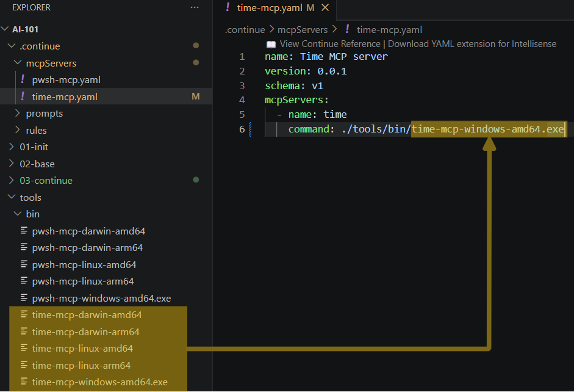

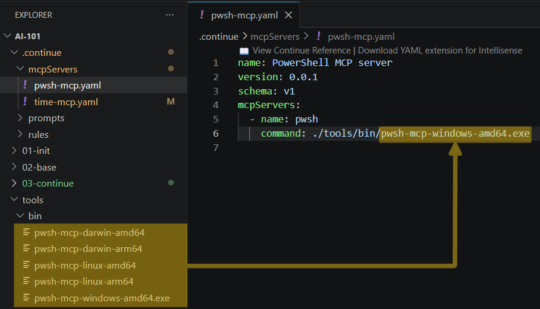

### Tool invocation examples

Once the MCP servers are configured, you can try to invoke prompts, rules and MCP tools from the Continue chat interface.

#### First prompt example
Choose mode to "Agent" and write "get current date" prompt. The AI should request approval:

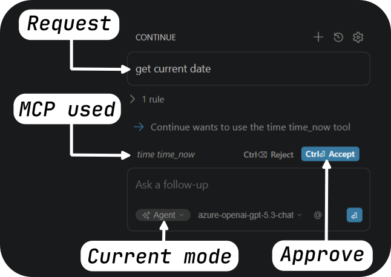

If approval is granted, you should get the current system time returned by the time-mcp server:

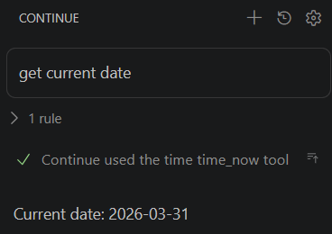

#### Second try

Now try to get current date using Powershell MCP instead of time-mcp:

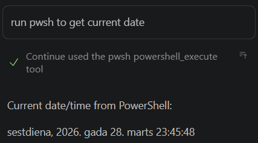

#### Third try

Now try to request to write a PowerShell script that stores current date, OS and IP (should use pwsh-mcp server and follow PowerShell scripting conventions defined in the powershell rule):

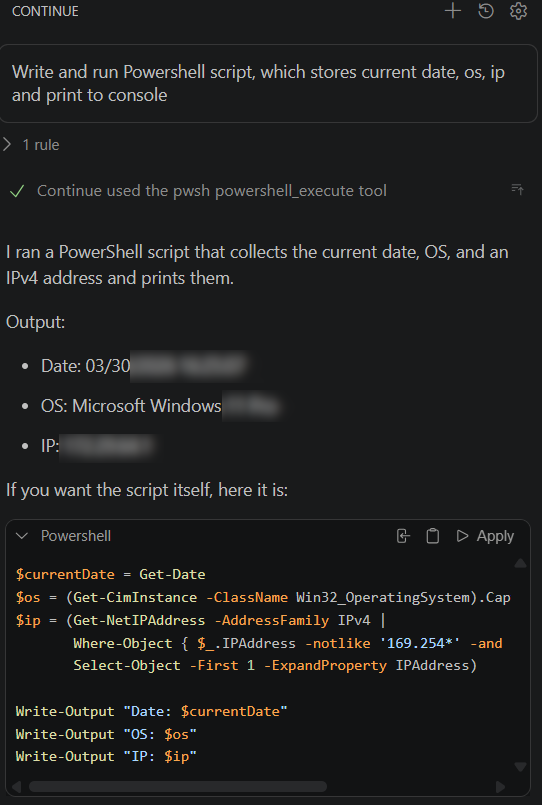

Now write in chat /reddit (this will invoke reddit prompt) and ask to write a Reddit post about the PowerShell script you just created:

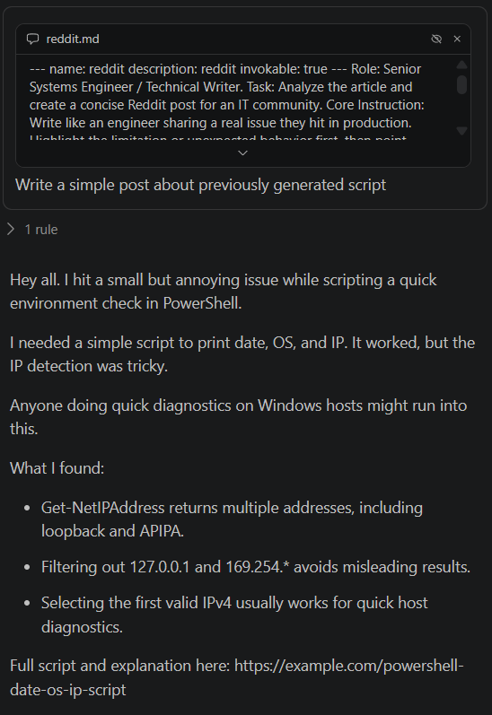

### Summary

In this tutorial you learned how to configure and extend the Continue AI assistant.

You explored:

• the **Chat, Plan, and Agent modes**  
• the role of **rules and prompts**  
• the architecture of the **Model Context Protocol (MCP)**  
• how to configure **workspace rules and prompts**  
• how to connect **external tools using MCP servers**

These capabilities transform the AI assistant from a simple chat interface into a **powerful development companion integrated directly into your IDE**.
