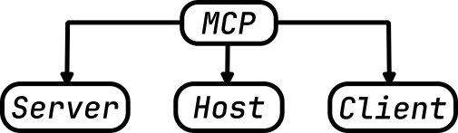

# AI 101: AI IDE Basics (Part 3)


In this tutorial we continue exploring using AI in VS Code. So far we have focused mainly on interacting with the AI through prompts. In this part we move one step further and explore **how to configure and extend the assistant itself**.

You will learn how Continue can be customized using rules, prompts, and external tools. We will also introduce the **Model Context Protocol (MCP)**, a standard architecture that allows AI systems to safely interact with external services.

By the end of this tutorial you will understand how to turn a basic AI assistant into a **tool‑enabled development environment**.

## What you will build

In this tutorial you will configure Continue to behave like a **custom AI development assistant for your project**.

Specifically, you will:

• configure **workspace rules** that guide the AI’s behavior  
• create **reusable prompts** for common development tasks  
• connect **external tools using MCP servers**  
• allow the AI to execute those tools directly from the IDE

To demonstrate this, we will connect two simple MCP servers:

• [**time‑mcp**](./tools/src/time-mcp) — provides system time utilities  
• [**pwsh‑mcp**](./tools/src/pwsh-mcp) — exposes PowerShell commands and information

These examples illustrate how AI assistants can interact with **real tools instead of only generating text**.

## Overview

Continue provides several mechanisms that allow developers to control:

• how the AI behaves  
• what information it can access  
• which external tools it can use

The main components are shown below.


The key elements of the Continue ecosystem are:

• **Rules** — persistent instructions that shape the AI's behavior  
• **Prompts** — reusable instructions for specific tasks  
• **Modes** — different levels of AI autonomy  
• **MCP servers** — external tools that extend the AI's capabilities

Together these components allow developers to control both the **behavior** and the **capabilities** of the AI assistant.


## Continue configuration

The Continue extension can be configured to control how it behaves inside VS Code and what capabilities are available to the AI model.

Configuration typically defines:

• which AI models are available  
• rules that guide the AI's behavior  
• reusable prompts  
• MCP servers that expose external tools

These configuration elements allow teams to create a **consistent AI workflow across projects**.

For example, a team might configure Continue to:

• always follow project coding standards  
• provide prompts for common development tasks  
• connect to internal documentation systems  
• expose scripts or automation tools through MCP

This makes the AI assistant behave more like a **specialized development tool** rather than a generic chatbot.


## Modes

Continue supports several operating modes.  
Each mode determines **how much autonomy the AI has** and which tools it is allowed to use.

| Mode | Purpose | Capabilities | Typical Usage |
| -- | --- | --- | --- |
| Chat | Conversational assistance | No tools available | Learning, discussion, brainstorming |
| Plan | Safe exploration and planning | Read‑only tools | Code inspection and solution design |
| Agent | Task execution | Full tool access | Implementing changes and automation |

Typical workflow:

1. Use **Chat** to understand a problem  
2. Use **Plan** to explore the codebase and design a solution  
3. Use **Agent** to implement the changes


## System Rules and Prompts

Continue allows developers to customize AI behavior using **Rules** and **Prompts**.

Although they both influence how the AI responds, they serve different purposes.


### Rules

Rules are **persistent instructions** added to the AI system context.

They apply to every interaction inside a project and ensure that the AI consistently follows project guidelines.

Examples of rules:

• Always follow the project's coding conventions  
• Prefer TypeScript over JavaScript  
• Avoid modifying files outside the current module  
• Keep functions small and focused

Rules help enforce **team standards and architectural decisions**.


### Prompts

Prompts are **task‑specific instructions** used when performing a particular action.

Unlike rules, prompts are not always active.  
They are invoked only when needed.

Typical prompts might include:

• generate unit tests for this file  
• refactor this code for readability  
• convert this function to async/await  
• generate API documentation

Prompts allow teams to standardize common development workflows.


### Rules vs Prompts

The main difference between rules and prompts is their **scope and persistence**.

Rules influence **every interaction** with the AI inside the workspace.

Prompts are **temporary instructions** used for a specific task.

Used together, they provide both:

• **long‑term behavioral guidance**  
• **short‑term task instructions**


## Model Context Protocol (MCP)

The **Model Context Protocol (MCP)** is an open standard designed to allow AI models to interact with external systems.

Instead of embedding integrations directly inside the AI assistant, MCP provides a standardized interface that allows tools to be connected dynamically.

Through MCP, an AI system can interact with:

• databases  
• file systems  
• APIs  
• automation tools  
• development platforms such as GitHub

This allows AI assistants to move beyond simple text generation and perform **real development tasks**.

## MCP Architecture

MCP uses a **host–client–server architecture** that separates the AI model from the external tools it uses.



### Host

The **host** is the application where the AI assistant runs.

In this tutorial, the host is **VS Code with the Continue extension**.

The host manages:

• user interaction  
• the AI model  
• security boundaries

### Client

The **client** is the communication layer inside the host.

It translates AI requests into MCP messages and maintains connections to MCP servers.

### Server

An **MCP server** exposes external functionality to the AI assistant.

Examples include services that provide:

• database queries  
• API access  
• system utilities  
• developer tools


### MCP in simple terms

A useful way to think about MCP is:

**MCP is like USB‑C for AI systems.**

Before USB‑C, every device required its own connector or adapter.

AI integrations face a similar problem today.  
Every AI system typically requires custom integrations for:

• APIs  
• developer tools  
• internal services  
• databases

MCP standardizes this interaction.

Developers implement an **MCP server once**, and any compatible AI system can use it.

## Continue configuration paths

Continue can be configured globally or per workspace.

#### Global configuration directory

macOS / Linux

`~/.continue`

Windows

`%USERPROFILE%\.continue`

#### Main configuration file

`config.yaml`

If this file is missing, Continue falls back to:

`config.json`

#### Workspace configuration

Projects can include their own configuration inside the repository:

```
.continue
 ├─ rules/
 ├─ prompts/
 └─ mcpServers/
```

Workspace configuration allows teams to share AI behavior across the project.


## Continue configuration

In the following steps we will configure three components:

1. Rules  
2. Prompts  
3. MCP servers

All configuration will be placed inside the workspace `.continue` directory.


## Create a rules file

Rules define persistent behavioral instructions for the AI assistant.

#### Step 1 — Create the directory

```
.continue/rules
```

#### Step 2 — Create a rule file

```
.continue/rules/project-rules.md
```

Example content:

```
## Project Rules

- Follow the existing project structure and naming conventions
- Prefer TypeScript over JavaScript
- Avoid unnecessary dependencies
- Write clear and maintainable code
```

#### Step 3 — Reload Continue

Reload VS Code or restart the Continue extension.

The rules will now influence all AI responses in this workspace.


## Create a prompt file

Prompts provide reusable instructions for common tasks.

#### Step 1 — Create the directory

```
.continue/prompts
```

#### Step 2 — Create a prompt

```
.continue/prompts/generate-tests.md
```

Example prompt:

```
Generate unit tests for the selected file.

Requirements:
- Use the existing project testing framework
- Cover typical and edge cases
- Use clear test names
```

Prompts can now be reused whenever the task is needed.


## Create an MCP server configuration file

MCP servers extend the AI assistant with external tools.

Each server configuration is stored in:

```
.continue/mcpServers
```


## Installing MCP servers

This tutorial includes two example MCP servers:

• **time-mcp** — returns system time  
• **pwsh-mcp** — executes PowerShell commands

Both servers are implemented using the **MCP Go SDK**.


### Step 1 — Create the MCP configuration directory

```
.continue/mcpServers
```


### Step 2 — Configure the Time MCP server

Create the file:

```
.continue/mcpServers/time-mcp.yaml
```

Configuration:

```
name: Time MCP server
version: 0.0.1
schema: v1

mcpServers:
  - name: time
    command: ./tools/bin/time-mcp-windows-amd64.exe
```


### Step 3 — Configure the PowerShell MCP server

Create:

```
.continue/mcpServers/pwsh-mcp.yaml
```

Configuration:

```
name: PowerShell MCP server
version: 0.0.1
schema: v1

mcpServers:
  - name: pwsh
    command: ./tools/bin/pwsh-mcp-windows-amd64.exe
```


### Step 4 — Choose the correct binary for your OS

Use the appropriate executable from the `tools/bin` directory.

Windows (x64)

```
pwsh-mcp-windows-amd64.exe
time-mcp-windows-amd64.exe
```

Linux (x64)

```
pwsh-mcp-linux-amd64
time-mcp-linux-amd64
```

Linux (ARM64)

```
pwsh-mcp-linux-arm64
time-mcp-linux-arm64
```

macOS Intel

```
pwsh-mcp-darwin-amd64
time-mcp-darwin-amd64
```

macOS Apple Silicon

```
pwsh-mcp-darwin-arm64
time-mcp-darwin-arm64
```


### Step 5 — Restart Continue

Restart VS Code or reload the Continue extension.

Continue will:

1. start the MCP servers  
2. discover their tools  
3. make those tools available to the AI model


## Tool invocation examples

Once the MCP servers are running, the AI assistant can call their tools.

Example requests:

“What time is it?” → `time_now`  
“Give me the Unix timestamp.” → `time_unix`  
“List installed PowerShell modules” → `powershell_list_modules`  
“Show the first 5 running processes” → `powershell_execute`


## Why this matters

These examples demonstrate the real value of MCP.

Instead of embedding integrations directly into the AI assistant, we simply:

1. implement an MCP server  
2. register its tools  
3. connect the server to Continue

The AI immediately gains new capabilities.

This same approach can expose:

• internal APIs  
• databases  
• monitoring systems  
• CI/CD pipelines  
• documentation platforms  
• custom development tools

MCP allows AI assistants to become **fully integrated development tools**.


## Summary

In this tutorial you learned how to configure and extend the Continue AI assistant.

You explored:

• the **Chat, Plan, and Agent modes**  
• the role of **rules and prompts**  
• the architecture of the **Model Context Protocol (MCP)**  
• how to configure **workspace rules and prompts**  
• how to connect **external tools using MCP servers**

These capabilities transform the AI assistant from a simple chat interface into a **powerful development companion integrated directly into your IDE**.
