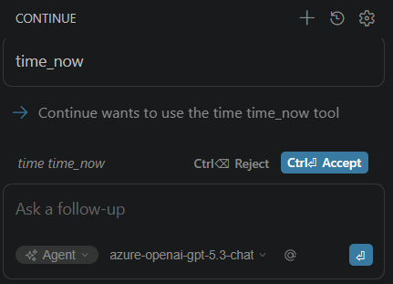
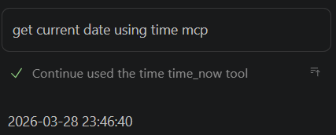

# AI 101: AI IDE Basics (Part 3)


In this tutorial, we continue exploring the capabilities of **Continue**, an AI coding assistant available as a VS Code extension. We'll cover its various modes, customization options, and introduce the **Model Context Protocol (MCP)**—an architecture designed to connect AI models with external tools, services, and data sources.


## Overview

Continue supports several configurations and tools that allow users to control how the AI interacts and what it can access. The main parts looks following:


* Rules - persistent instructions that influence the AI's behavior across all interactions.
* Prompts - temporary instructions for specific tasks or workflows.
* MCPs - standardized interfaces that allow the AI to securely access external systems and tools.
* Modes - different levels of AI autonomy, from conversational to fully autonomous task execution.

### Modes

Depending on the mode, the AI has different capabilities and limitations. The three main modes are:

| Mode | Purpose | Capabilities/Limitations | Usage Context |
|---|---|---|---|
| **Chat** | Provides conversational assistance for explaining concepts, comparing approaches, and discussing code. | **No tools available**; purely conversational and does not modify code. | Ideal for asking questions, understanding code, or brainstorming ideas. |
| **Plan** | Facilitates safe exploration and solution planning before making any changes. | **Read-only tools**; no modifications to files. | Best used for codebase inspection, bug investigation, or planning implementations. |
| **Agent** | Executes development tasks end-to-end with full tool access. | **All tools available**; capable of reading files, modifying code, and executing commands. | Used for implementing code changes, fixing bugs, or automating tasks. |

These modes allow users to control **how much autonomy the AI has**, ranging from simple conversations to full task execution.


## System Rules and Prompts

Continue allows developers to customize how the AI behaves using **Rules** and **Prompts**.

### Rules

Rules are **persistent instructions** added to the system context. They influence the AI’s behavior across all interactions.

Examples of rules:

- Always follow project coding standards
- Prefer TypeScript over JavaScript
- Avoid modifying files outside the current module

Rules ensure the AI behaves consistently across sessions and aligns with team practices.


### Prompts

Prompts are **temporary instructions** used for specific tasks or workflows.

Examples include:

- Generate unit tests for this file
- Refactor this code for readability
- Convert this function to async/await

Prompts are reusable but **session-focused**, meaning they do not permanently change the AI’s behavior.


### Rules vs Prompts

The key difference is scope:

- **Rules:** persistent behavior configuration
- **Prompts:** temporary task-specific instructions

Together, they provide both **long-term behavioral control** and **short-term task guidance**.


**Shortened technical text**

## Model Context Protocol (MCP)

MCP is an open standard that enables AI models to interact with external tools, services, and data sources.  

Capabilities exposed through MCP interfaces include:

- Query databases  
- Access files and documents  
- Trigger automation tools  
- Interact with development platforms (e.g., GitHub)

Developers connect systems using **MCP‑compatible interfaces** instead of building custom integrations.

## MCP Architecture Components

MCP uses a **host–client–server architecture**.

### Host

- Application where the AI model runs and interacts with the user.  
- Manages user interface, authentication, and security boundaries.

### Client

- Communication layer inside the host.  
- Translates AI requests into MCP messages.  
- Maintains connections with MCP servers.  
- Handles message exchange using the MCP protocol.  
- Each connected server typically uses a dedicated client instance.

### Server

- Provides access to external systems.  
- Can expose:
  - databases
  - APIs
  - file systems
  - development tools
  - internal services

Architecture separates **AI reasoning** from **external capabilities**.


## MCP in simple terms

Think of MCP as **USB‑C for AI systems**.

Before USB‑C, every device required its own cable or adapter. Integrating devices was messy and inconsistent.

AI integrations currently face the same problem.

Every AI system requires custom connectors to interact with:

- databases
- APIs
- developer tools
- internal services

MCP standardizes this interaction.

Instead of building dozens of custom integrations, developers implement **one MCP interface**, and any compatible AI system can use it.


## Using MCP Servers in Continue

In this tutorial you can find two example MCP servers:

- [**time-mcp**](../tools/src/time-mcp) — for retrieving system time  
- [**pwsh-mcp**](../tools/src/pwsh-mcp) — for executing PowerShell commands and retrieving PowerShell information  

Both use the [MCP Go SDK](https://github.com/modelcontextprotocol/go-sdk) to implement the MCP protocol.

## MCP Server Operation

1. Continue launches the MCP server as a separate process.  
2. The server registers tools.  
3. Continue discovers available tools.  
4. The AI model can invoke those tools.


## Installing MCP Servers

The configuration files should be placed in:

.continue/mcpServers/

Each server is defined in its own YAML file.

### Step 1 — Create configuration directory

If it does not already exist, create the directory:

.continue/mcpServers

### Step 2 — Configure the PowerShell MCP server

Create the file:

.continue/mcpServers/pwsh-mcp.yaml

Example configuration:

```
name: PowerShell MCP server
version: 0.0.1
schema: v1
mcpServers:
  - name: pwsh
    command: ../tools/bin/pwsh-mcp-windows-amd64.exe
```

### Step 3 — Configure the Time MCP server

Create the file:

.continue/mcpServers/time-mcp.yaml

Example configuration:

```
name: Time MCP server
version: 0.0.1
schema: v1
mcpServers:
  - name: time
    command: ../tools/bin/time-mcp-windows-amd64.exe
```

### Step 4 — Choose the correct binary for your OS

The `tools/bin` directory contains binaries for several operating systems and architectures.

Use the appropriate executable for your system:

Windows (x64)

```
../tools/bin/pwsh-mcp-windows-amd64.exe
../tools/bin/time-mcp-windows-amd64.exe
```

Linux (x64)

```
../tools/bin/pwsh-mcp-linux-amd64
../tools/bin/time-mcp-linux-amd64
```

Linux (ARM64)

```
../tools/bin/pwsh-mcp-linux-arm64
../tools/bin/time-mcp-linux-arm64
```

macOS (Intel)

```
../tools/bin/pwsh-mcp-darwin-amd64
../tools/bin/time-mcp-darwin-amd64
```

macOS (Apple Silicon)

```
../tools/bin/pwsh-mcp-darwin-arm64
../tools/bin/time-mcp-darwin-arm64
```

### Step 5 — Restart Continue

After adding the configuration files, restart VS Code or reload the Continue extension.

Continue will automatically start the configured MCP servers and discover their tools.

---

## Tool Invocation Examples

- “What time is it?” → `time_now`  
- “Give me the Unix timestamp.” → `time_unix`  
- “List installed PowerShell modules” → `powershell_list_modules`  
- “Show the first 5 running processes” → `powershell_execute`  
- “What parameters does Get-Process support?” → `powershell_get_command`






## Why This Matters

These examples illustrate the real value of MCP.

Instead of hard‑coding integrations into the AI assistant, we simply:

1. Create a small MCP server
2. Register tools
3. Connect the server to Continue

Immediately the AI gains **new capabilities**.

The same approach can be used to expose:

- internal APIs
- databases
- monitoring systems
- CI/CD pipelines
- documentation platforms
- custom development tools

This makes MCP a powerful way to extend AI assistants into **fully integrated development environments**.

## Summary

In this tutorial, we explored several foundational concepts for working with AI-powered IDE assistants.

You learned:

- The **three main Continue modes**: Chat, Plan, and Agent
- How **Chat mode** supports discussion and learning
- How **Plan mode** enables safe exploration of a codebase
- How **Agent mode** can execute complex development tasks
- The difference between **Rules** and **Prompts**
- The architecture and purpose of the **Model Context Protocol (MCP)**

Together, these tools enable developers to move from simple AI assistance to **powerful, tool-enabled AI workflows inside the IDE**.

In the next tutorials, these concepts will become even more useful as we begin connecting AI assistants to real development tools and infrastructure.